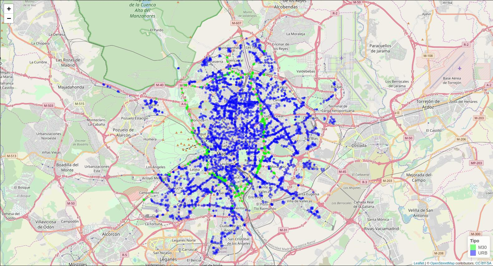
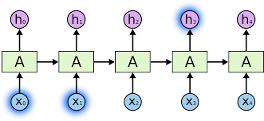

```{r setup, include = FALSE}
require(TFFutils)
require(magrittr)
require(DBI)
require(RMySQL)
require(padr)
require(imputeTS)
require(keras)
require(xts)
require(ggplot2)
require(reshape2)
require(broom)
require(lubridate)
require(forecast)
require(jsonlite)
require(data.table)
require(dplyr)
require(gridExtra) 
require(grid) 
require(parallel)
require(kable)
require(kableExtra)
require(tidyr)
require(png)
require(knitr)

tff.release.pool()

knitr::opts_chunk$set(
  warning = FALSE,
  message = FALSE,
  echo = FALSE,
  cache = TRUE,
  collapse = TRUE,
  comment = "#>"
  )
```


# Introducción

    

## Objetivos

- recopilar datos de tráfico en Madrid
- determinar propiedad objetivo 
- pronóstico con métodos clásicos
- pronóstico con métodos basados en aprendizaje profundo


# Datos 

    

## Dos conjuntos

- ubicación de los dispositivos de medida
- histórico de datos del tráfico desde 2013

<br/>
<br/>

<small>
DIRECCIÓN GENERAL DE GESTIÓN Y VIGILANCIA DE LA CIRCULACION  
SUBDIRECCIÓN GENERAL DE REGULACIÓN DE LA CIRCULACION Y DEL SERVICIO DEL TAXI  
DEPARTAMENTO TECNOLOGÍAS DEL TRÁFICO  
ÁREA DE GOBIERNO DE MODIO AMBIENTE Y MOVILIDAD  
AYUNTAMIENTO DE MADRID
</small>


## Datos de localización

- 14 archivos publicados irregularmente en el tiempo
- tipos de dispositivo: M30 o URB
- 98,5% de dispositivos no cambian de localización
- el resto los descartamos del estudio

<br/>

```{r}
tff.get.parsed.location(y=2018, m=9) %>% head %>% kable %>% kable_styling(font_size = 16)
tff.release.pool()
```


## Ubicación geográfica 

```{r}

```


## Datos de medidas


- 58 archivos publicados mensualmente
- 100 MB / fichero aprox. (zip)
- 800 MB / fichero aprox. (no zip)
- enero 2015 a octubre 2018 
- 4.500 dispositivos aprox.

<br/>

```{r}
tff.get.parsed.metrics(y=2018, m=9, d=4001) %>% head %>% kable %>% kable_styling(font_size = 16)
tff.release.pool()
```
 

## Propiedades importantes

- intensidad: uso de la vía (vehículos/hora)
- ocupación: tiempo de ocupación de la vía (%)
- carga: f(intensidad, ocupación y capacidad) (%)

<br/>

```{r}
tff.get.parsed.metrics(y=2018, m=9, d=4001) %>% head %>% kable %>% kable_styling(font_size = 16)
tff.release.pool()
```


## Objetivo: carga

- significativa en sí mismo del estado de la vía
- fácilmente interpretable (%)
- informado en todos los dispositivos (no sólo M30, como vmed)
- fallas en los datos equivalente a otras propiedades
    - intensidad: 4% errores 
    - ocupación: 8% errores
    - carga: 5% errores

    

## Ejemplo

```{r}
tff.get.parsed.metrics(y=2018,m=8,d=4000) %>% tff.clean %>% tff.pad %>% na.interpolation %>% 
  tail(1000) %>% .[,c("fecha","carga")] %>% tff.as.xts %>% autoplot() + 
  labs(x = "Fecha", title="Carga del dispositivo 4.000 en agosto de 2018")
tff.release.pool()
```


# Metodología

    

## Etapas

- revisión bibliográfica
    - Rob J. Hyndman - modelos clásicos
    - Christopher Olah - redes neuronales
    - ...

- preparación de datos
    - comprensión y saneado
    - aprovisionamiento en BBDD
    - programación de funciones de utilidad


## Etapas (cont. 1)

- selección de modelos
    - prototipado con combinaciones de parámetros, metaparámetros y arquitecturas
    - combinaciones de estacionalidad
    - agrupados por familia
    
- técnica de backtesting
    - instante aleatorio para cada serie
    - todos los modelos pronostican en el mismo punto
    - registro exhaustivo de las realizaciones de todos los experimentos


## Etapas (cont. 2)

- análisis de resultados    
    - selección del mejor modelo por familia
    - selección del mejor modelo intra familias
    - segmentando por series con mejor calidad de datos

- interpretación/explicación de los resultados


# Modelos

    

## Familia STL

```{r}
data.4000 <- tff.get.parsed.metrics(d = 4000) %>% tff.clean %>% tff.pad %>% na.interpolation %>% 
    .[,c("fecha","carga")] %>% head(nrow(.) - 4*24*3) 
tff.release.pool()

tff.plot.exps <- function(exps) {
    expected <- exps[1,]
    expected$name <- "Esperado"
    expected$predicted <- expected$expected
    mseries <- cbind(tff.exp.to.xts(expected),
                     if(1<nrow(exps)) apply(exps, 1, tff.exp.to.xts) else tff.exp.to.xts(exps[1,]))
    names(mseries) <- c("Esperado", exps$name)
    tidy(mseries) %>%  
      mutate(series = forcats::fct_reorder(series, series!='Esperado')) %>%
      ggplot(aes(x=index,y=value, color=series)) + geom_line()
}

data.4000 %>% tail(4*24*31) %>% tff.as.ts(4*24*7) %>% stl(s.window = "periodic", robust=TRUE) %>%  
  autoplot(main = "Descomposición STL con estacionalidad semanal")  + 
  xlab('i-ésimo día') +  ylab('% carga')
rm(data.4000)
```


## Familia MSTL

```{r}
data.4000 <- tff.get.parsed.metrics(d = 4000) %>% tff.clean %>% tff.pad %>% na.interpolation %>% 
    .[,c("fecha","carga")] %>% head(nrow(.) - 4*24*3) 
tff.release.pool()

data.4000 %>% tail(4*24*31) %>%  tff.as.msts(c(4*24, 4*24*7)) %>% mstl(s.window = "periodic", robust=TRUE) %>%  
  autoplot(main = "Descomposición MSTL con estacionalidad diaria y semanal")  + 
  xlab('i-ésimo día') +  ylab('% carga')
rm(data.4000)
```


## Pronóstico STL y MSTL

```{r}
exps.stl <- tff.get.conn() %>% dbGetQuery("select * from experiments_new where d=4000 and name in ('tff.stl.w','tff.stlm.dwm')")
exps.stl$name[exps.stl$name=='tff.stl.w'] <- "STL"
exps.stl$name[exps.stl$name=='tff.stlm.dwm'] <- "MSTL"
tff.plot.exps(exps.stl) + labs(x = "Fecha", y="% carga", 
                               title="Pronóstico con STL y MSTL (d,w,m) para el dispositivo 4.000")
```


## Familia ARIMA

- ARIMA(p,d,q)
    - AR: $y_{t} = c + \phi_{1}y_{t-1} + \dots + \phi_{p}y_{t-p} + \varepsilon_{t}$
    - I: orden de diferenciación (serie estacionaria)
    - MA: $y_{t} = c + \theta_{1}\varepsilon_{t-1} +  \dots + \theta_{q}\varepsilon_{t-q} + \varepsilon_t$

- SARIMA(p,d,q,P,D,Q)$_n$
    - ARIMA que incluye modelado de la componente estacional
    
- forecast::auto.arima()    


## Pronóstico (S)ARIMA

```{r}
exps.arima <- tff.get.conn() %>% dbGetQuery("select * from experiments_new where d=4000 and name in ('tff.auto.arima.tail','tff.sarima.tail.101.111')")
exps.arima$name[exps.arima$name=='tff.auto.arima.tail'] <- "ARIMA"
exps.arima$name[exps.arima$name=='tff.sarima.tail.101.111'] <- "SARIMA"
tff.plot.exps(exps.arima) + labs(x = "Fecha", y="% carga", 
                                 title="Pronóstico con ARIMA y SARIMA para el dispositivo 4.000")
```
    
    
## Familia LSTM 

<!-- https://cdn-images-1.medium.com/max/800/1*laH0_xXEkFE0lKJu54gkFQ.png -->


```{r}

```


## Pronóstico LSTM

```{r}
exps.lstm <- tff.get.conn() %>% dbGetQuery("select * from experiments_new where d=4000 and name in('tff.lstm.exogeno.scale.mean','tff.lstm.scale.mean')")
exps.lstm$name[exps.lstm$name=='tff.lstm.exogeno.scale.mean'] <- "LSTM Exógeno"
exps.lstm$name[exps.lstm$name=='tff.lstm.scale.mean'] <- "LSTM"
tff.plot.exps(exps.lstm) + 
  labs(x = "Fecha", y="% carga", title="Pronóstico con modelos LSTM para el dispositivo 4.000")
```


## Familia Mixta

Se han diseñado variantes de modelos mixtos:

- ajustando primero un modelo STL a la serie
- ajustando después un modelo LSTM a los residuos del modelo anterior


## Pronóstico Mixto

```{r}
exps.mixto <- tff.get.conn() %>% dbGetQuery("select * from experiments_new where d=4000 and name in ('tff.stl.w.tail.lstm.resample.5.identity','tff.stl.w.tail.lstm.scale.mean')")
exps.mixto$name[exps.mixto$name=='tff.stl.w.tail.lstm.resample.5.identity'] <- "Mixto resample"
exps.mixto$name[exps.mixto$name=='tff.stl.w.tail.lstm.scale.mean'] <- "Mixto escalando"
tff.plot.exps(exps.mixto) + 
  labs(x = "Fecha", y="% carga", title="Pronóstico con modelos Mixtos para el dispositivo 4.000")
```


## Modelos probados

Familia | Modelos
--------|---------
STL | 7 
MSTL |  4
ARIMA | 2
LSTM | 4
LSTM Exógeno | 2
Mixto STL + LSTM | 2


```{r}
experimentos <- tff.get.conn() %>% dbGetQuery("select count('x') from experiments_new") %>% format(big.mark = ".")
horas <- tff.get.conn() %>% dbGetQuery("select floor(sum(time)/(60*60)) from experiments_new") %>% format(big.mark = ".")
tff.release.pool()
```

Todos los modelos se han probado en todas las series, constituyendo:

- `r experimentos` experimentos 
- `r horas` horas de computación


# Resultados

    

## Mejor por familia

Familia | Modelo
--------|---------
STL | STL W Reciente 
MSTL |  STLM DWM Reciente
ARIMA | SARIMA
LSTM | LSTM Agg4 Scale SD
LSTM Exógeno | LSTM-Exo DH Raw Scale Mean
Mixto STL + LSTM | STL+LSTM Agg5 Scale Mean


## RMSE

```{r}
tff.get.accs.top <- function(exps, Nombres) {
    fname <- "/home/amanas/tff-madrid/data/accs.top.RData"
    if(file.exists(fname)){
        load(fname)
        accs.top
    } else {
        stop("no hay archico precalculado de accs")
    }
}
tff.get.accs.top(NULL, NULL) %>% 
  select(-c(Device)) %>% 
  group_by(Nombre,Horizonte) %>% summarise_all(mean, na.rm=T) %>% 
  ggplot() + geom_line(aes(Horizonte, RMSE, group=Nombre, colour=Nombre)) + 
  ggtitle(paste("RMSE por horizontes")) + xlab("Horizonte") + ylab("RMSE")
```


## RMSE 5% gaps


```{r}
tff.release.pool()
gaps <- tff.get.conn() %>% dbGetQuery("select * from carga_gaps") 
tff.release.pool()
tff.get.accs.top(NULL, NULL) %>% 
  filter(Device %in% (gaps %>% filter(percentageNAs<5) %>% .$device %>% unique)) %>%
  select(-c(Device)) %>% 
  group_by(Nombre,Horizonte) %>% summarise_all(mean, na.rm=T) %>% 
  ggplot() + geom_line(aes(Horizonte, RMSE, group=Nombre, colour=Nombre)) + 
  ggtitle(paste("RMSE por horizontes (gaps < 5%)")) + xlab("Horizonte") + ylab("RMSE")
rm(gaps)
```


# Conclusiones


    

## Objetivos cumplidos

- datos recopilados
- comprendidos
- pronósticos con modelos paramétricos y no paramétricos
    - STL y STLM pronostican mejor a muy corto plazo (< 6h)
    - LSTM iguala e incluso supera a corto plazo (< 48h)
    - mayor importancia de la parte reciente de la serie


## Trabajo futuro

- profundizar en las capacidades LSTM
- explorar:
    - arquitecturas
        - modelos de entrada múltiple
        - variables exógenas
    - agregaciones de los datos
    - experimentar reduciendo la ventana "train"
    - incorporar la componente espacial al modelo
    - modelo único en infraestructura Big Data
    - etc.


## Recomendaciones

- muestra estratificada de series
- descarte de series con fallas excesivas
- series de laboratorio (sobre todo para LSTM)


## Continuidad

- datos en AWS (S3)
- código en Github - @amanas
    - 4 repos (utilidades, libro, wip y presentación)
    - 2.000+ lineas de código de utilidad
    - 280+ commits


# ?


# Gracias


